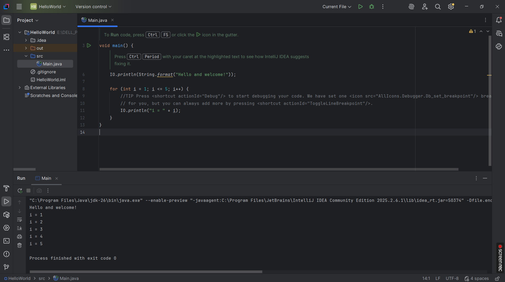
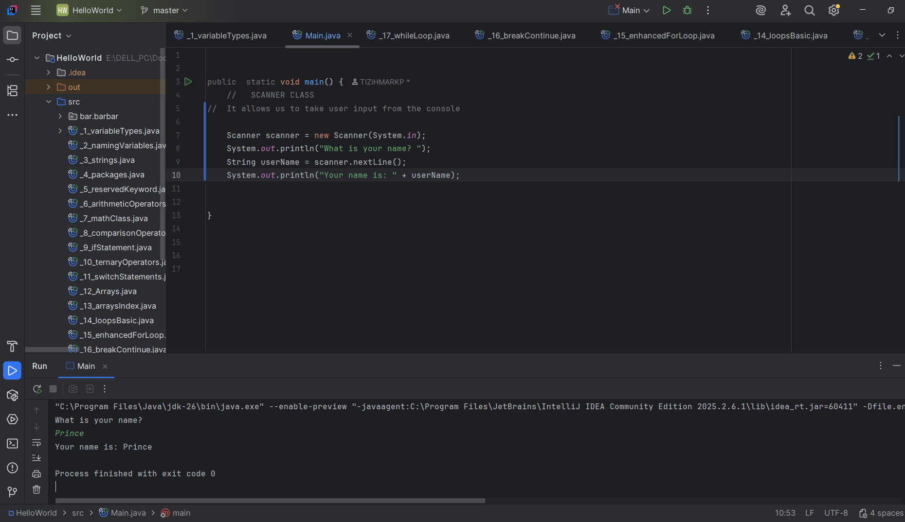

# TIZIH MARKO Java Learning Journey - Beginner Fundamentals

This repository contains my first Java programs and notes from completing a comprehensive beginner's course in Java programming.

## Topics Covered

### Core Java Concepts
- **JDK, JRE, and JVM** - Understanding the Java Development Kit, Runtime Environment, and Virtual Machine architecture
- **JDK versions** - Overview of different Java versions and LTS releases
- **Code execution flow** - How Java code gets compiled and executed (Compilation & Execution)

### Development Environment
- **IntelliJ IDEA setup** - Installation and configuration
- **Running Java code** - Executing programs from both terminal and IntelliJ

### Java Editions
- Java Standard Edition (SE)
- Java Enterprise Edition (EE)
- Java Micro Edition (ME)
- Java Card

### Programming Fundamentals

**Variables & Data Types**
- Primitive data types (int, double, boolean, char, etc.)
- Reference data types
- Variable naming conventions

**Core Concepts**
- String class and string manipulation
- Packages, import keyword, and reserved keywords
- Arithmetic operations
- Math class and useful methods

**Control Flow**
- Comparison operators
- Boolean and logical operators
- If statements
- Ternary operators
- Switch statements

**Arrays & Loops**
- Arrays and array indexes
- For loops
- Enhanced for loop (for-each)
- Break and continue statements
- While loop and do-while loop

**Input & Methods**
- Scanner class for user input
- Methods and built-in methods
- Method creation and invocation

**Object-Oriented Programming**
- Classes and objects
- Basic OOP concepts

## Project Structure

src/

├── Main.java # Entry point examples

├── variables/ # Variable and data type examples

├── controlflow/ # If, switch, ternary examples

├── loops/ # For, while, do-while examples

├── arrays/ # Array manipulation examples

├── methods/ # Method creation and usage

└── oop/ # Classes and objects basic examples

## How to Run

1. Open project in IntelliJ IDEA
2. Navigate to any `.java` file
3. Click the green play button or right-click and select "Run"

## Technologies Used

- Java (JDK 26 or later)
- IntelliJ IDEA Community Edition
- Git for version control

## Key Takeaways

- Java is compiled to bytecode then runs on JVM, making it platform independent
- Strong typing requires explicit variable declaration
- Java is object-oriented but supports primitive types for performance
- The Scanner class provides flexible user input handling

## Next Steps

I plan to continue learning:
- Advanced OOP (inheritance, polymorphism, encapsulation, abstraction)
- Exception handling
- Collections framework
- File I/O operations
- Multithreading basics

## Acknowledgments

This repository documents Tizih Mark progress through a beginner Java programming course. All code was written by me as practice exercises.

---
*Learning Java - Building a strong foundation one line of code at a time*

*May 2026*
